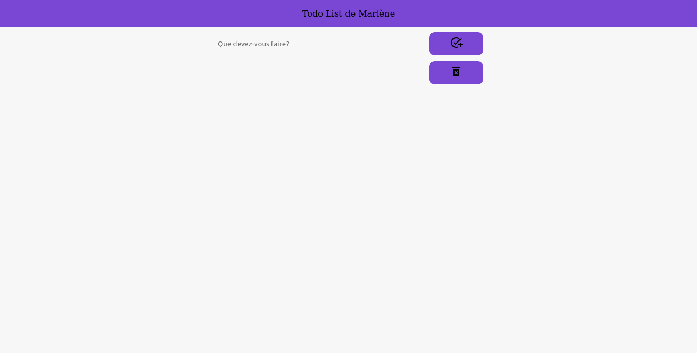
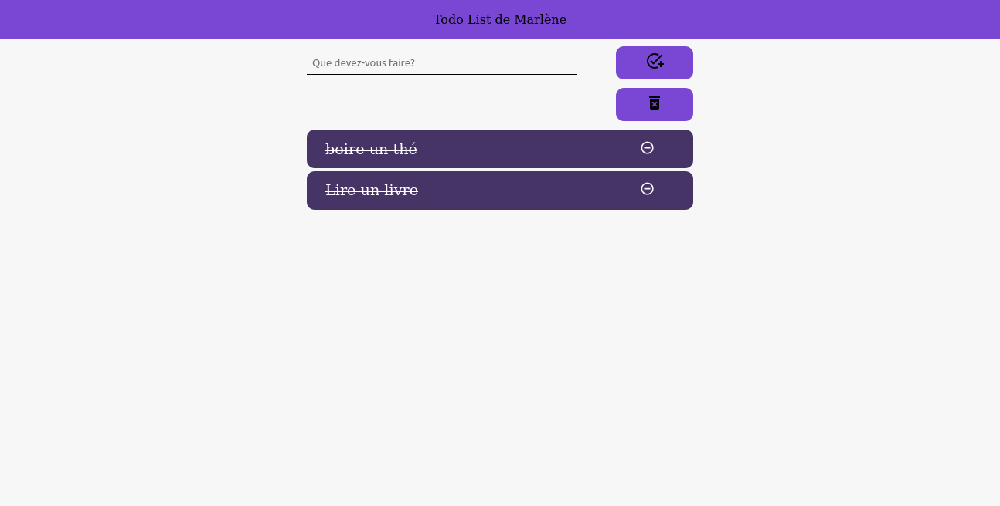
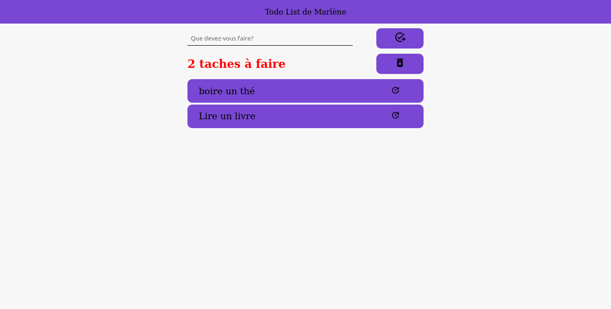

# Todolist
  

Travail dans le cadre de la formation [Becode](https://becode.org/), nous devions faire une todo list avec le framework react.

L'application stocke ses données dans le cache, pour pouvoir le récupéré après un rafraichissement de page.
* On peut ajouter des taches
* La mofidier
* effacé les taches complètés ou individuellement
* On nous dit le nombre de tâche il nous reste à faire
 
# Langage utilisé:
* Js -> React
* JSX
* CSS

# Travail effectué par:
[Marlene Bouvard](https://github.com/llyllyra/todolist-react)

# deployer sur Netlify:
[Lien](https://sparkling-sundae-d37a22.netlify.app/)

